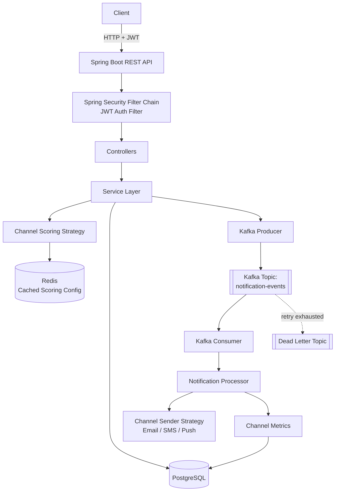
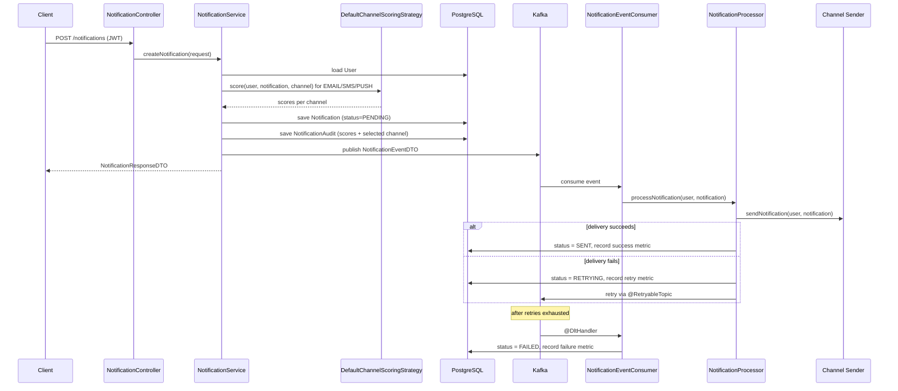

# SignalLoop

An event-driven notification delivery system with dynamic, score-based channel selection, built on Spring Boot and Apache Kafka.

SignalLoop accepts a notification request, decides which channel (Email, SMS, or Push) is best suited to deliver it based on a configurable scoring algorithm, publishes the decision as an event to Kafka, and asynchronously delivers and tracks the outcome — recording both the delivery result and the reasoning behind the channel choice.

---

## Overview

Most notification systems hardcode delivery logic: "if urgent, send SMS; otherwise, send email." SignalLoop replaces that with a weighted scoring model that combines three factors — the user's preferred channel, the notification's urgency, and each channel's live reliability (success/failure history) — into a single score per channel, and picks the highest-scoring one at request time.

The system is split into two phases:

1. **Synchronous phase** — the API request is authenticated, validated, scored, and persisted. The scoring decision itself is recorded in an audit table for traceability.
2. **Asynchronous phase** — a Kafka event is published for the created notification. A separate consumer picks up the event, resolves the appropriate channel sender via the Strategy pattern, attempts delivery, and updates the notification's status. Failures are retried through Kafka's retry topics before landing in a dead-letter topic.

Channel reliability itself is not static — every send outcome updates a per-channel success/failure/retry counter, which feeds back into the scoring algorithm on the next request. This creates a feedback loop where channels that are currently failing are automatically deprioritized.

### High-Level Architecture



---

## Features

### Authentication & Authorization
- Stateless JWT authentication (HMAC-SHA256 signed tokens via `jjwt`)
- Role-based access control with `ROLE_USER` and `ROLE_ADMIN`
- Method-level authorization via `@PreAuthorize` on admin endpoints
- BCrypt password hashing
- Custom `UserDetailsService` backed by the user repository

### Notification Processing
- Notification creation with dynamic channel selection at request time
- Channel decision persisted separately in an audit table (`notification_selection_audit`) with the individual score for every channel
- Notification status lifecycle: `PENDING → SENT` / `RETRYING` / `FAILED`
- Strategy-pattern channel senders (`EmailSender`, `SmsSender`, `PushSender`) resolved at runtime through a factory

### Dynamic Channel Scoring
- Configurable weighted scoring across three factors: user channel preference, notification urgency, and channel reliability
- Factor weights and urgency-per-channel weights stored in the database and adjustable via an admin API
- Scoring configuration cached in Redis (`@Cacheable`) and evicted on update (`@CacheEvict`)

### Reliability Metrics
- Per-channel success/failure/retry counters (`channel_metrics` table)
- Reliability score derived dynamically from historical success/failure counts and fed back into the scoring algorithm

### Kafka Messaging
- Notification events published to a dedicated topic (`notification-events`) after creation
- Consumer-side idempotency check (skips events for notifications already `SENT`)
- Automatic retry via `@RetryableTopic` with exponential backoff (4 attempts)
- Dead-letter topic handling via `@DltHandler` — marks the notification `FAILED` and records a reliability failure on exhaustion

### Caching
- Redis-backed Spring Cache abstraction for the scoring configuration

### Database
- PostgreSQL with schema and seed data managed by Flyway migrations
- Six tables: `users`, `notifications`, `factor_percentage`, `urgency_weight`, `notification_selection_audit`, `channel_metrics`

### API Layer
- MapStruct-based DTO ↔ entity mapping across all modules
- Bean validation (`jakarta.validation`) on request payloads
- Centralized exception handling via `@RestControllerAdvice`, returning a consistent JSON error shape

### Monitoring
- Spring Boot Actuator with `health` and `info` endpoints exposed

### Containerization
- Multi-container setup via Docker Compose: application, PostgreSQL, Redis, and Kafka (KRaft mode, no Zookeeper)
- Application Dockerfile built on `eclipse-temurin:21-jre`

---

## Tech Stack

| Category | Technology |
|---|---|
| Language | Java 17 |
| Framework | Spring Boot 4.0.5 |
| Web | Spring Web (Spring MVC) |
| Security | Spring Security, JWT (`io.jsonwebtoken` / jjwt 0.13.0), BCrypt |
| Persistence | Spring Data JPA, PostgreSQL |
| Migrations | Flyway |
| Messaging | Apache Kafka, Spring for Apache Kafka |
| Caching | Spring Cache, Redis (Spring Data Redis) |
| Mapping | MapStruct |
| Boilerplate Reduction | Lombok |
| Resilience | Spring Retry, Spring AOP (`spring-aspects`) |
| Build Tool | Maven |
| Containerization | Docker, Docker Compose |
| Testing | JUnit 5, Mockito |

---

## Project Structure

```
src/main/java/com/notification/system/
├── SystemApplication.java
│
├── auth/                          # Authentication & authorization
│   ├── JwtAuthFilter.java         # OncePerRequestFilter: extracts & validates JWT
│   ├── JwtAuthUtil.java           # Token generation, parsing, validation
│   ├── SecurityConfig.java        # Security filter chain, password encoder, auth provider
│   ├── controller/                # AuthController, AdminController
│   ├── dto/                       # Login/Signup request & response DTOs
│   ├── enums/                     # Role
│   └── service/                   # JwtAuthService, CustomUserDetailsService
│
├── common/exception/              # GlobalExceptionHandler, ApiError
│
├── notification/
│   ├── audit/                     # Channel-selection audit trail (entity, mapper, repository, service, controller)
│   ├── config/                    # AsyncConfig (thread pool executor bean)
│   ├── controller/                # NotificationController
│   ├── dto/                       # NotificationRequestDTO, NotificationResponseDTO
│   ├── entity/                    # Notification
│   ├── enums/                     # NotificationStatus
│   ├── exception/                 # NotificationNotFoundException
│   ├── kafka/                     # KafkaConfig, producer, consumer, event DTO/mapper, delivery exception
│   ├── mapper/                    # NotificationMapper
│   ├── processor/                 # NotificationProcessor (delivery orchestration)
│   ├── reliabilityMetrics/        # ChannelMetrics (entity, repository, service, mapper, controller, calculators)
│   ├── repository/                # NotificationRepository
│   ├── scoringAlogirthm/          # Scoring strategy, weights, factors, config service, Redis config
│   └── strategy/                  # NotificationSender interface + EmailSender/SmsSender/PushSender + factory
│
└── user/                          # User entity, DTOs, mapper, repository, service, controller
```

---

## Database Design

All schema objects are created via Flyway migration `V1__initial_schema.sql`; seed data for the scoring configuration comes from `V2__seed_scoring_configuration.sql`.

| Table | Purpose |
|---|---|
| `users` | Application users. Stores email, hashed password, timezone, preferred channel, and role. |
| `notifications` | Core notification records: message, urgency, assigned channel, delivery status, retry count. References `users`. |
| `factor_percentage` | Weight (%) assigned to each scoring factor (`USER_PREFERENCE`, `URGENCY`, `RELIABILITY`). Editable via admin API. |
| `urgency_weight` | Weight (%) for each (urgency, channel) pair — e.g. `HIGH`/`SMS`. Unique per combination. |
| `notification_selection_audit` | Records the per-channel score (email/SMS/push) and the selected channel for every notification, for traceability. References `notifications`. |
| `channel_metrics` | Running success/failure/retry counters per channel, keyed by channel name. Feeds the reliability factor in scoring. |

**Relationships:**
- `notifications.user_id → users.id` (many-to-one)
- `notification_selection_audit.notification_id → notifications.notification_id` (many-to-one)
- `channel_metrics.channel` is the primary key (one row per `Channel` enum value: `EMAIL`, `SMS`, `PUSH`)

Indexes exist on `notifications.user_id` and `notifications.notification_status` for lookup performance.

---

## Notification Flow



Request lifecycle in short: **JWT authentication → bean validation → channel scoring → persistence → audit record → Kafka publish → async consumption → strategy-based delivery → status update → reliability metric update**.

---

## Authentication

SignalLoop uses stateless JWT authentication:

1. **Signup** (`POST /auth/signup`) creates a `ROLE_USER` account with a BCrypt-hashed password.
2. **Login** (`POST /auth/login`) authenticates credentials via Spring Security's `AuthenticationManager` and returns a signed JWT (`LoginResponseDTO`) containing the user ID.
3. Every subsequent request must include `Authorization: Bearer <token>`.
4. `JwtAuthFilter` (a `OncePerRequestFilter`, registered before `UsernamePasswordAuthenticationFilter`) extracts and validates the token, loads the user via `CustomUserDetailsService`, and populates the `SecurityContext`.
5. Tokens are signed with HMAC-SHA256, expire 24 hours after issuance, and carry `userId` as a custom claim.
6. Endpoints under `/auth/**` are public; every other endpoint requires a valid token (`SecurityConfig`).
7. Admin-only endpoints (`/admin/**`) are additionally restricted with `@PreAuthorize("hasRole('ADMIN')")`.

---

## Monitoring

Spring Boot Actuator is enabled with the following endpoints exposed:

- `GET /actuator/health` — application health status
- `GET /actuator/info` — application info

No additional Actuator endpoints (metrics, Prometheus, etc.) are exposed in the current configuration.

---

## Docker

The stack is defined in `docker-compose.yml` with four services:

| Service | Image | Purpose |
|---|---|---|
| `postgres` | `postgres:16` | Primary datastore |
| `redis` | `redis:7-alpine` | Scoring configuration cache |
| `kafka` | `apache/kafka:4.1.0` | Event broker (KRaft mode — combined broker + controller, no Zookeeper) |
| `notification-system` | built from local `Dockerfile` | The Spring Boot application |

The application container depends on all three infrastructure services and connects to them using environment-variable-driven connection settings. The `Dockerfile` runs the pre-built jar (`target/*.jar`) on `eclipse-temurin:21-jre` and exposes port `8080`.

```bash
docker compose up -d --build
```

---

## Configuration

Configuration is split across three files:

- **`application.yml`** — shared defaults: Kafka topic settings (`notification-events`, 3 partitions, 3 replicas), Redis cache name, Flyway settings, server port (`8080`), and the active profile (`dev` by default).
- **`application-dev.yml`** — local development: SQL/Hibernate debug logging enabled, `ddl-auto: validate`, connects to `localhost` Redis.
- **`application-prod.yml`** — production: verbose SQL logging disabled, Redis/Kafka hosts read from environment variables.

Profile is selected via `spring.profiles.active` (defaults to `dev`; override with `SPRING_PROFILES_ACTIVE` in Docker/production).

---

## Getting Started

### Prerequisites
- Java 17
- Maven (or use the included `mvnw` wrapper)
- Docker & Docker Compose (for PostgreSQL, Redis, Kafka)

### 1. Clone the repository
```bash
git clone <repository-url>
cd signalLoop-dev
```

### 2. Configure environment variables
Copy the example file and fill in real values:
```bash
cp .env.example .env
```

### 3. Start infrastructure dependencies
```bash
docker compose up -d postgres redis kafka
```

### 4. Run database migrations
Flyway runs automatically on application startup (`spring.flyway.enabled: true`).

### 5. Run the application

With Maven:
```bash
./mvnw spring-boot:run
```

Or build the full stack (app + infra) with Docker Compose:
```bash
docker compose up -d --build
```

### 6. Verify it's running
```bash
curl http://localhost:8080/actuator/health
```

---

## Environment Variables

| Variable | Purpose | Required | Default |
|---|---|---|---|
| `POSTGRES_DB` | Postgres database name (Compose) | Yes | `notification_db` |
| `POSTGRES_USER` | Postgres username (Compose) | Yes | `postgres` |
| `POSTGRES_PASSWORD` | Postgres password (Compose) | Yes | `postgres` |
| `DB_URL` | JDBC URL used by the application | Yes | `jdbc:postgresql://postgres:5432/notification_db` |
| `DB_USERNAME` | Application datasource username | Yes | `postgres` |
| `DB_PASSWORD` | Application datasource password | Yes | `postgres` |
| `JWT_SECRET` | HMAC signing key for JWT tokens | Yes | — |
| `REDIS_HOST` | Redis host | Yes | `redis` |
| `REDIS_PORT` | Redis port | Yes | `6379` |
| `KAFKA_BOOTSTRAP_SERVERS` | Kafka broker address(es) | Yes (prod) | `localhost:9092` (dev default in `application.yml`) |
| `SPRING_PROFILES_ACTIVE` | Active Spring profile | No | `dev` |

---

## API Examples

### Sign up
```bash
curl -X POST http://localhost:8080/auth/signup \
  -H "Content-Type: application/json" \
  -d '{
    "email": "<email>",
    "password": "<password>",
    "preferredChannel": "EMAIL",
    "timezone": "Asia/Kolkata"
  }'
```

### Login
```bash
curl -X POST http://localhost:8080/auth/login \
  -H "Content-Type: application/json" \
  -d '{
    "email": "<email>",
    "password": "<password>"
  }'
```

### Create a notification
```bash
curl -X POST http://localhost:8080/notifications \
  -H "Content-Type: application/json" \
  -H "Authorization: Bearer <JWT_TOKEN>" \
  -d '{
    "userId": 1,
    "message": "Your order has shipped",
    "urgency": "HIGH"
  }'
```

### Get a notification by ID
```bash
curl -X GET http://localhost:8080/notifications/1 \
  -H "Authorization: Bearer <JWT_TOKEN>"
```

### Get notifications by status
```bash
curl -X GET http://localhost:8080/notifications/status/PENDING \
  -H "Authorization: Bearer <JWT_TOKEN>"
```

### Get notifications for a user
```bash
curl -X GET http://localhost:8080/notifications/user/1 \
  -H "Authorization: Bearer <JWT_TOKEN>"
```

### Get channel selection audit
```bash
curl -X GET http://localhost:8080/notifications/audit/1 \
  -H "Authorization: Bearer <JWT_TOKEN>"
```

### Get channel reliability metrics
```bash
curl -X GET http://localhost:8080/metrics/channels/EMAIL \
  -H "Authorization: Bearer <JWT_TOKEN>"
```

### Admin: list users (paginated)
```bash
curl -X GET "http://localhost:8080/admin/all?page=0&size=20&sort=createdAt,desc" \
  -H "Authorization: Bearer <ADMIN_JWT_TOKEN>"
```

### Admin: update scoring factor weights
```bash
curl -X PUT http://localhost:8080/admin/scoring/factors \
  -H "Content-Type: application/json" \
  -H "Authorization: Bearer <ADMIN_JWT_TOKEN>" \
  -d '{
    "factorWeights": {
      "USER_PREFERENCE": 50,
      "URGENCY": 30,
      "RELIABILITY": 20
    }
  }'
```

---

## Security

- **Authentication**: JWT (HMAC-SHA256), validated on every request via a custom `OncePerRequestFilter`.
- **Password storage**: BCrypt via Spring Security's `PasswordEncoder`.
- **Session management**: Stateless (`SessionCreationPolicy.STATELESS`) — no server-side session state.
- **CSRF**: Disabled, appropriate for a stateless, token-authenticated API.
- **Authorization**: Role-based (`ROLE_USER`, `ROLE_ADMIN`) enforced with `@PreAuthorize` on admin routes, in addition to the global authenticated-by-default rule in `SecurityConfig`.

---

## Error Handling

A centralized `@RestControllerAdvice` (`GlobalExceptionHandler`) maps exceptions to a consistent JSON error body (`ApiError`: `status`, `message`, `timestamp`):

| Exception | HTTP Status |
|---|---|
| `UsernameNotFoundException` | 404 Not Found |
| `NotificationNotFoundException` | 404 Not Found |
| `EmailExistException` | 409 Conflict |
| `AuthenticationException` | 401 Unauthorized |
| `JwtException` | 401 Unauthorized |
| `AccessDeniedException` | 403 Forbidden |
| `NotificationDeliveryException` | 500 Internal Server Error |
| `MethodArgumentNotValidException` (bean validation failures) | 400 Bad Request |
| Any other unhandled `Exception` | 500 Internal Server Error |

---

## Contributing

1. Fork the repository and create a feature branch from `dev`.
2. Follow the existing package-by-feature structure.
3. Add tests for any service-layer changes (JUnit 5 + Mockito).
4. Make sure `mvn clean verify` passes locally.
5. Open a PR into `dev` with a clear description of what changed and why.

---

## License

MIT — see [LICENSE](./LICENSE).